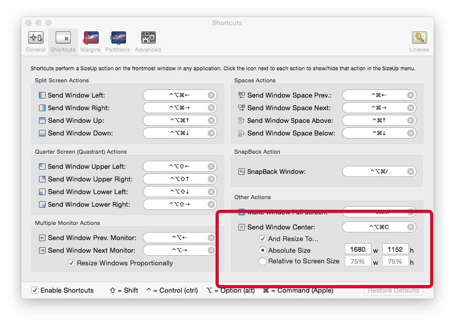

# Generating Screenshots 

There are 2 workflows here that will help you speed up the process of generating screenshots. 

> **Note**: the workflows are currently setup to make @1x screenshots. You will need to modify the sizing and dimensions inside the Automator workflows if you want to make @2x screenshots. 

### Requirements

* [SizeUp.app](http://www.irradiatedsoftware.com/sizeup/) is used to size the RapidWeaver window to the exact dimensions that we need. 
* [Acorn.app](http://flyingmeat.com/acorn/) is used to automate the process of applying the screenshots to the screenshot template provided. You will need to non-MAS version of Acorn becuase of sandboxing issues related to scripting the app. 

### Step 1: Taking the Screenshots

> All of the screenshots taken using this workflow will be saved to a folder named `RW6-Screenshots` on your desktop. The image files will be named based on the project file that was used to take them. 

1. You will want to configure the size of the window inside the SizeUp application to match the required size of the window. I recommend that you use `1680x1152` or a similar ratio. In step 2, the image will be scaled down to fit properly inside the screenshot template. 

> If you want your screenshots to look as sharp as possible, you should take them at `1060x726`. However, this is not much screen real estate to show off your addon. This is why I recommend that you take larger screenshots that will be scaled down to fit inside the screenshot template later on.
2.  Drag a project file onto the `1-RW6Screenshots.app` file. You should only do one project file at any one time. 
3. At this time the RapidWeaver project file will open and be properly size. 
4. You will then be prompted to take screenshot #1. You should move this dialog box out of the way and prepare the RapidWeaver project file for its first screenshot. 
5. When you are ready to take the first screenshot, click `Continue` on the Automatot dialog box. 
6. You must now hover over the RapidWeaver project window and click it. This will save the screenshot to the folder on your desktop. 
7. The dialog box for the next screenshot will appear. Repeat steps 4-6 for screenshots #2 and #3. If you do not want to take a second or thrid screenshot, simply click `Cancel` and the workflow will exit. 
8. After you have taken all of your screenshots, you can safely move onto the next project file!

### Step 2: Applying the Screenshot Template

> Its recommended that you take all screenshots for your products before running this action. It will save you some time since this step can process all of the images in batch. 

1. Copy the `RW6ScreenshotTemplate.acorn` file into the same directory as the screenshot files. 
2. Select as many screenshot images as you want and drag them onto the `2-FinalScreenshots.app`. 
3. Lots of magic will happen _really really fast_. 
4. You are done! All of the final screenshot files will be saved to a `_final-screenshots` folder. 

